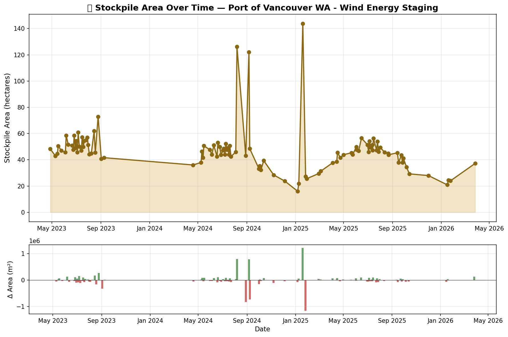

# Sentinel Stockpile

### The economy you can see from space.

Every year, the Pacific Northwest lumber supply chain does the same thing. Mills cut timber all summer. Logs pile up at export terminals along the Columbia River. Ships carry them to Asia. Then winter comes, logging roads close, and the yards go quiet.

Sixty miles downstream, a different kind of cargo tells a different kind of story. Wind turbine blades — 250 feet long, nearly as tall as the Statue of Liberty — arrive on ships from China and Europe, stage on the docks, and truck out through the Columbia River Gorge at 3 a.m. to wind farms across the interior West. How busy those docks are tells you something about the future of American energy.

We know all this because we watched it happen — from 500 miles up.

---

## Site 1: Port of Longview — Lumber


That's 12 months of lumber stockpile area at the **Port of Longview, Washington**, the largest log export terminal on the Columbia River. Every dot is a measurement taken from a European Space Agency satellite called Sentinel-2, which photographs every point on Earth every five days at 10-meter resolution.

<table>
<tr>
<td width="50%">

**July 13, 2025 — Peak season**


</td>
<td width="50%">

**January 16, 2026 — Winter low**


</td>
</tr>
</table>

The reddish-brown rectangles in the upper left are log stacks. The bright white patches in the center are dimensional lumber or tarped material. In July, they're everywhere. In January, the yard is mostly empty pavement.

<table>
<tr>
<td width="50%">

**July — classified (32% stockpile)**


</td>
<td width="50%">

**January — classified (3.4% stockpile)**


</td>
</tr>
</table>

Amber = stockpile. Blue = water. Brown = ground. Green = vegetation.

### The seasonal story

The signal is textbook commodity economics:

- **Spring (April–May):** ~20–23 hectares. Mills ramping up, logging roads drying out.
- **Summer (June–July):** Climbs to 47 hectares. Peak harvest, mills running full production, lumber accumulating faster than ships can carry it out.
- **Fall (August–September):** Drops back to 22 hectares. Export vessels loading for Asian construction markets.
- **Winter (January):** Down to 5 hectares. Rain shuts logging roads, mills cut shifts, the Columbia River lumber supply chain exhales.

This is the seasonal pulse of a $40 billion industry, measured with free tools.

---

## Site 2: Port of Vancouver WA — Wind Energy



The Port of Vancouver is the West Coast's main entry point for wind turbine components. Blades, nacelles, tower sections — they arrive by ship, stage on the terminal laydown pads, and truck out through the Columbia River Gorge to wind farms in Eastern Oregon, Eastern Washington, and as far as Saskatchewan.

The pattern here is completely different from lumber. No smooth seasonal curve — instead, a **sawtooth**: spikes when ships arrive and unload hundreds of components onto the yard, drops as trucks haul them out one by one over the following days. You're literally watching individual vessel deliveries resolve in the satellite data.

### Three summers, one question

We pulled three years of data: summer 2023, summer 2024, and summer 2025. The question was whether President Trump's January 20, 2025 executive order — which halted all new federal permits, approvals, and loans for wind projects — would show up in the yard.

| | Summer 2023 | Summer 2024 | Summer 2025 |
|---|---|---|---|
| **Peak (ha)** | ~73 | ~53 | ~57 |
| **Typical range** | 45–61 | 36–53 | 39–57 |
| **Context** | Biden admin, IRA incentives | Biden admin, rising rates | Post-EO, permit freeze |

**The answer is more interesting than we expected.** The decline started *before* the executive order. Summer 2024 — still fully under Biden, Inflation Reduction Act incentives in place — was already significantly below 2023. Interest rates, supply chain friction, and general industry headwinds were doing the work, not policy.

Summer 2025 actually recovered slightly from 2024. The pipeline of already-permitted projects kept flowing — blades on the dock today were contracted 2–3 years ago.

**The EO's real impact — frozen permits preventing new projects from being greenlit — won't show up in yard utilization for years.** There's a long lag between permitting and component delivery. The blades that *would have* been ordered for 2027–2028 wind farms are the ones that won't arrive. We're watching the lag built into industrial supply chains, and we'll keep monitoring.

The port itself has noted that wind energy throughput has always been cyclical, tied to tax credit renewals and permitting cycles. This data gives that observation a number.

---

## How it works

The data is free. The algorithms aren't secret. This project is proof that you can build meaningful commodity intelligence with open tools and open data — the same kind of analysis that hedge funds pay six figures a year for.

**The trick is that different materials reflect light differently.** Lumber is brighter than pavement. Wind turbine blades — white fiberglass — are brighter still. Vegetation is greener than everything. Water absorbs most light. The satellite captures six spectral bands, and we compute indices that quantify these differences:

- **NDVI** (vegetation index) — identifies trees and grass so we can exclude them
- **BSI** (bare soil index) — separates textured surfaces like lumber stacks from smooth pavement
- **Brightness** — catches the actual stockpile material

Each pixel gets classified. Count the stockpile pixels, multiply by pixel area (100 m²), and you have a measurement. Do it 106 times over three years, and you have a time series that tells economic stories.

The classification thresholds were tuned empirically — looking at satellite imagery with human eyes, comparing it to classifier output, adjusting until the math matched reality. It's part science, part craft. Every site and commodity needs its own tuning, which is why the project includes an interactive Jupyter notebook for the process.

---

## Try it yourself

```bash
# Install pixi
curl -fsSL https://pixi.sh/install.sh | bash

# Clone and set up
git clone https://github.com/bdgroves/sentinel-stockpile.git
cd sentinel-stockpile
pixi install

# Run the full pipeline for a site
pixi run pipeline --site longview_port --months 6
```

No API keys. No paid accounts. Everything runs on free data from [Microsoft Planetary Computer](https://planetarycomputer.microsoft.com/).

### Add your own site

Drop a JSON file in `config/sites/`:

```json
{
    "site_id": "my_site",
    "name": "Port of Somewhere",
    "commodity": "lumber",
    "latitude": 46.1065,
    "longitude": -122.9543,
    "buffer_meters": 600,
    "description": "What this site is and why you're watching it"
}
```

Run `pixi run pipeline --site my_site` and you're in business.

### Tune your thresholds

The included notebook (`notebooks/explore.ipynb`) walks you through true-color and false-color composites, spectral index distributions, and side-by-side classification validation. This is where the craft happens.

---

## What else can you watch from space?

This same approach works for anything that accumulates or depletes at a fixed location:

- **Container terminals** — trade disruptions show up as area changes weeks before they hit economic reports
- **Oil tank farms** — floating-roof tank shadows tell you fill levels; multiply across a farm and you estimate regional petroleum reserves
- **Grain elevators** — seasonal agricultural commodity flows, harvest timing, export patterns
- **Mining stockpiles** — coal, ore, aggregate; anything stored outdoors in bulk
- **Auto import lots** — vehicle inventory staging; tariff impacts visible as accumulation

The project is designed to be extensible. Each site is a JSON config. Each commodity has its own thresholds. Add a site, run the pipeline, get a time series.

---

## Project structure

```
sentinel-stockpile/
├── pixi.toml                 # Reproducible environment
├── config/sites/             # One JSON per monitoring site
│   ├── longview_port.json    # Port of Longview — lumber
│   ├── vancouver_wind.json   # Port of Vancouver — wind components
│   ├── tacoma_port.json      # Port of Tacoma — containers
│   └── weyerhaeuser_longview.json
├── src/
│   ├── fetch_imagery.py      # Sentinel-2 download via STAC API
│   ├── preprocess.py         # Band alignment and resampling
│   ├── classify.py           # Spectral classification
│   ├── measure.py            # Area computation and time series
│   ├── report.py             # Maps and charts
│   └── pipeline.py           # Orchestrator
├── notebooks/
│   └── explore.ipynb         # Interactive threshold tuning
├── output/                   # Generated results per site
├── docs/                     # Images for README
└── .github/workflows/
    └── monthly.yml           # Automated monitoring via GitHub Actions
```

## Current sites

| Site | Commodity | Scenes | Signal |
|------|-----------|--------|--------|
| Port of Longview | Lumber/Logs | 32 (12 months) | Clear seasonal cycle: summer peak 47 ha, winter low 5 ha |
| Port of Vancouver WA | Wind components | 106 (3 years) | Ship delivery sawtooth, year-over-year decline since 2023 |
| Port of Tacoma | Containers | Configured | Needs threshold tuning |
| Weyerhaeuser Longview | Lumber | Configured | Needs first run |

## Roadmap

- [x] Sentinel-2 imagery pipeline via Planetary Computer
- [x] Spectral index classification (NDVI, NDMI, BSI)
- [x] Time series measurement and reporting
- [x] Site configuration system
- [x] 12-month proof of concept — Port of Longview lumber
- [x] 3-year multi-administration comparison — Port of Vancouver wind energy
- [ ] Outlier detection for bad scenes (tile boundary, cloud shadow artifacts)
- [ ] Additional PNW sites (Tacoma containers, Weyerhaeuser, Kalama grain)
- [ ] Sentinel-1 SAR integration (sees through clouds — fills the PNW winter gap)
- [ ] Static dashboard on GitHub Pages
- [ ] Multi-year trend overlays (same months, different years)
- [ ] Oil tank shadow analysis
- [ ] Export to GeoJSON for QGIS overlay

---

## The honest limitations

**Resolution.** 10 meters per pixel. A single lumber stack is often smaller than a pixel. We're measuring "area dominated by stockpile material," not counting individual stacks or blades.

**Clouds.** Sentinel-2 is optical — it can't see through overcast. The PNW has a four-month cloud gap from October through January. Radar (Sentinel-1) would fix this.

**Thresholds are site-specific.** The brightness and BSI values that work for lumber at Longview don't work for wind components at Vancouver. Each commodity and site needs tuning.

**Outliers exist.** Some scenes have different tile footprints, cloud shadow contamination, or other artifacts that produce wild readings. Three scenes in the Vancouver dataset had to be manually identified and excluded. An automated outlier filter is on the roadmap.

**This is a proxy, not ground truth.** We're not counting board-feet of lumber or individual turbine blades. We're measuring how much of a terminal's surface area looks like stockpiled material from space. It's a useful signal, but it's not inventory data.

**Correlation is not causation.** The wind energy decline predated the executive order. Multiple factors — interest rates, supply chains, project pipeline timing — all contribute. We present the data; we don't claim to isolate causes.

---

## Tech stack

| Tool | Role |
|------|------|
| [pixi](https://pixi.sh) | Reproducible environment management |
| [pystac-client](https://github.com/stac-utils/pystac-client) | Search Planetary Computer's STAC catalog |
| [planetary-computer](https://github.com/microsoft/planetary-computer-sdk-for-python) | Sign asset URLs for download |
| [rasterio](https://rasterio.readthedocs.io/) | Read/write geospatial rasters |
| [numpy](https://numpy.org/) | Array math for spectral indices |
| [matplotlib](https://matplotlib.org/) | Charts and map visualization |
| [Sentinel-2 L2A](https://sentinel.esa.int/web/sentinel/missions/sentinel-2) | Free 10m multispectral imagery, every 5 days |

## Further reading

- **The Planet Money Book** — the economics-is-everywhere lens that inspired this project's approach
- **Planetary Computer [data catalog](https://planetarycomputer.microsoft.com/catalog)** — browse what's available for free
- **Port of Vancouver USA [wind energy news](https://www.portvanusa.com/)** — press releases on component shipments
- **Harvard EELP [offshore wind tracker](https://eelp.law.harvard.edu/tracker/federal-offshore-wind-deployment/)** — legal status of the federal wind permitting freeze

---

## License

MIT — use it, fork it, extend it, point it at something interesting.

*Built by [Brooks Groves](https://brooksgroves.com) in Lakewood, WA. Powered by free data from the European Space Agency and Microsoft Planetary Computer.*
