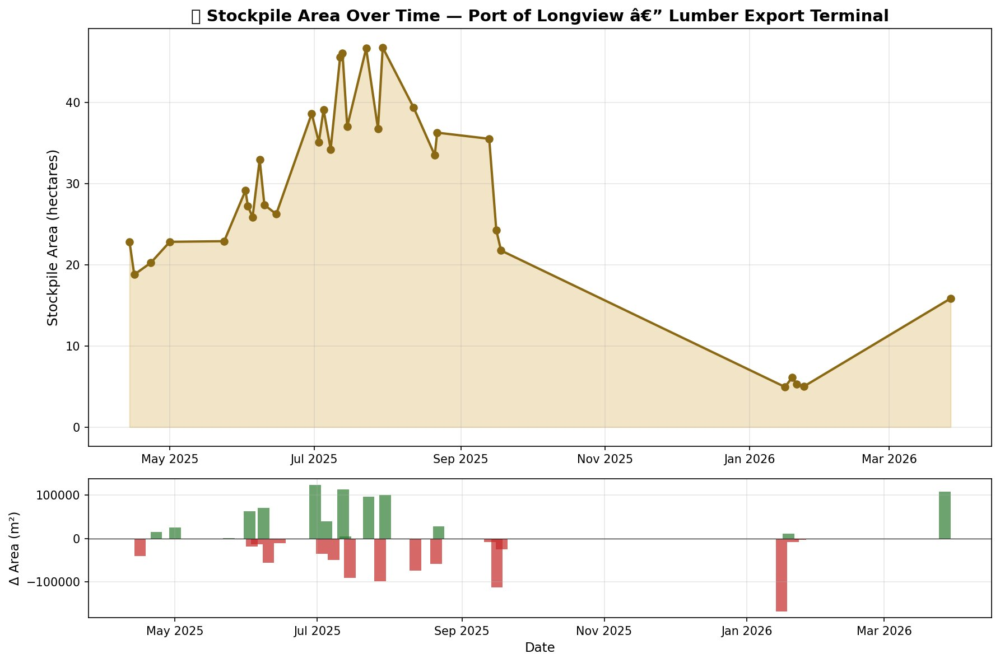
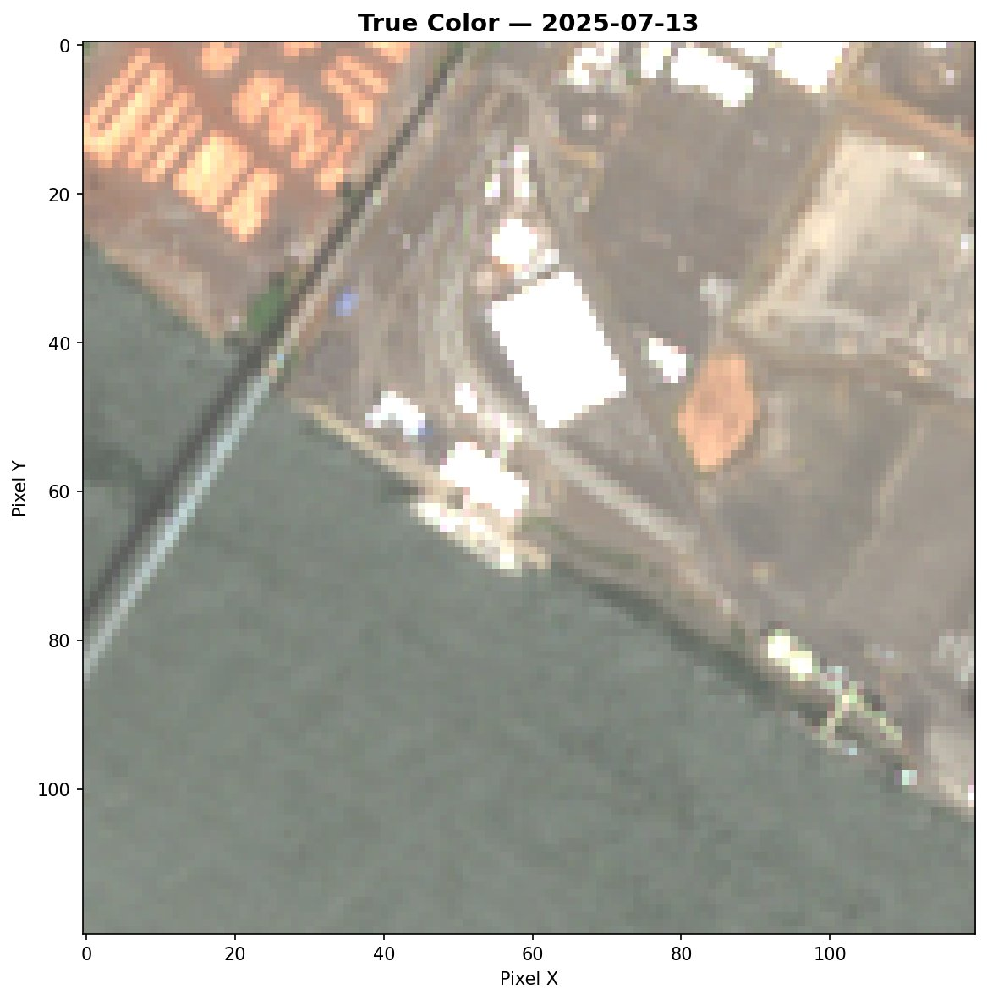
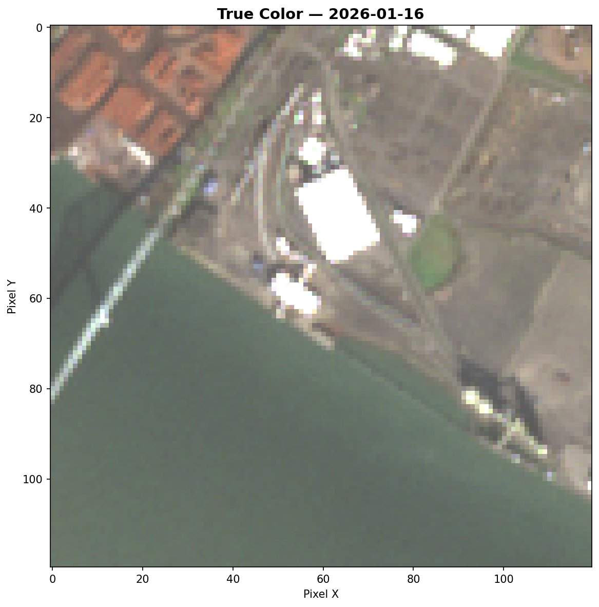
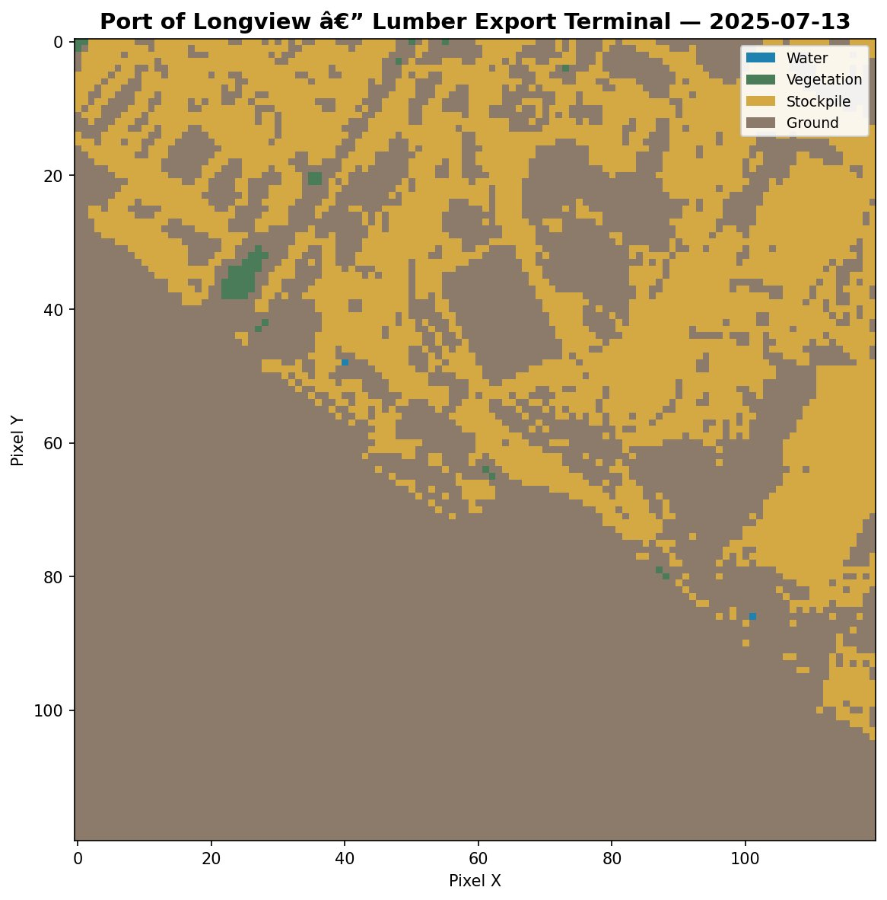
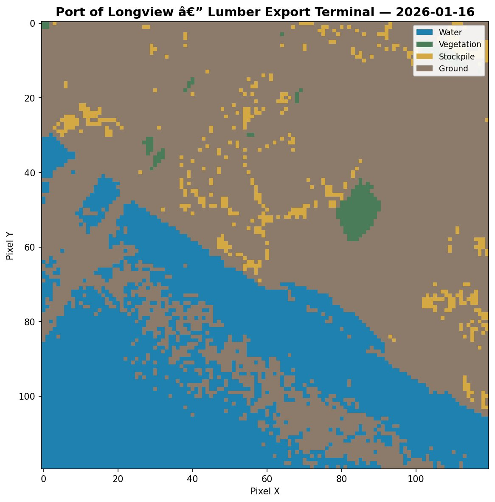

# Sentinel Stockpile

### The economy you can see from space.

Every year, the Pacific Northwest lumber supply chain does the same thing. Mills cut timber all summer. Logs pile up at export terminals along the Columbia River. Ships carry them to Asia. Then winter comes, logging roads close, and the yards go quiet.

We know this because we watched it happen — from 500 miles up.



That chart is 12 months of lumber stockpile area at the **Port of Longview, Washington**, the largest log export terminal on the Columbia River. Every dot is a measurement taken from a European Space Agency satellite called Sentinel-2, which photographs every point on Earth every five days at 10-meter resolution.

The data is free. The algorithms aren't secret. This project is proof that you can build meaningful commodity intelligence with open tools and open data — the same kind of analysis that hedge funds pay six figures a year for.

---

## The Planet Money version

Here's what's happening in that chart, and why it matters.

**Spring (April–May).** The yards are sitting at about 20 hectares of stockpiled lumber. Mills are spinning up after winter. Logging trucks are starting to roll as mountain roads dry out. Inventory is building from its annual low.

**Summer (June–July).** The curve ramps to 47 hectares by late July. This is peak harvest — Cascades timber sales in full swing, mills running double shifts, lumber accumulating at the port faster than ships can carry it out. If you drove past the Port of Longview in July, you'd see mountains of logs and stacks of dimensional lumber stretching across the terminal.

**Fall (August–September).** The drawdown. Export vessels loading out for Asian construction markets. You can literally watch the inventory liquidate in the satellite data — 47 hectares back down to 22 in six weeks.

**Winter (January).** Down to 5 hectares. Rain shuts down logging roads. Mills cut shifts. The Columbia River lumber supply chain exhales.

**And then spring comes again.**

This is the seasonal pulse of a $40 billion industry, visible from space, measured with free tools, and reproducible by anyone with a laptop.

---

## See it with your own eyes

Here's what the Port of Longview looks like from the satellite in summer vs. winter:

<table>
<tr>
<td width="50%">

**July 13, 2025 — Peak season**


</td>
<td width="50%">

**January 16, 2026 — Winter low**


</td>
</tr>
</table>

Those reddish-brown rectangles in the upper left? Log stacks. The bright white patches in the center? Dimensional lumber or tarped material. In July, they're everywhere. In January, the yard is mostly empty pavement.

Now here's what the classifier sees:

<table>
<tr>
<td width="50%">

**July — 32% stockpile**


</td>
<td width="50%">

**January — 3.4% stockpile**


</td>
</tr>
</table>

Amber = stockpile. Blue = water (the Columbia River). Brown = ground (pavement, roads). Green = vegetation.

---

## How it actually works

You don't need to understand remote sensing to use this. But if you're curious:

**The trick is that different materials reflect light differently.** Lumber is brighter than pavement. Vegetation is greener than everything. Water absorbs most light and looks dark. The satellite captures six spectral bands — visible light plus near-infrared and shortwave infrared — and we compute indices that quantify these differences.

Three indices do most of the work:

- **NDVI** (vegetation index) — identifies trees and grass so we can exclude them
- **BSI** (bare soil index) — separates textured surfaces like lumber stacks from smooth pavement
- **Brightness** — catches the actual stockpile material, which reflects more light than the surrounding terminal

Each pixel gets classified as water, vegetation, stockpile, or ground. Count the stockpile pixels, multiply by the pixel area (100 m² each), and you have a measurement in square meters. Do it across 32 scenes over 12 months, and you have a time series.

The thresholds that separate "stockpile" from "ground" were tuned empirically — looking at the satellite imagery with human eyes, comparing it to the classification output, and adjusting until the amber pixels land where the actual lumber sits. It's part science, part craft.

---

## Why this matters beyond lumber

This same approach works for anything you can see accumulating or depleting at a fixed location:

🏗️ **Container terminals** — are ports backing up or flowing? Trade disruptions show up as container area changes weeks before they hit economic reports.

🛢️ **Oil tank farms** — the shadow inside a floating-roof oil tank tells you how full it is. Multiply across a tank farm and you can estimate regional petroleum reserves.

🌾 **Grain elevators** — seasonal agricultural commodity flows visible from the accumulation patterns at storage and export facilities.

⛏️ **Mining stockpiles** — coal, ore, aggregate — anything stored outdoors in bulk before transport.

This project is designed to be extensible. Each monitoring site is a JSON config file. Each commodity type has its own classification thresholds. Add a site, run the pipeline, get a time series.

---

## Try it yourself

```bash
# Install pixi (package manager for reproducible environments)
curl -fsSL https://pixi.sh/install.sh | bash

# Clone and set up
git clone https://github.com/bdgroves/sentinel-stockpile.git
cd sentinel-stockpile
pixi install

# Run the full pipeline for Port of Longview
pixi run pipeline --site longview_port --months 6

# Or step by step:
pixi run fetch --site longview_port --months 6    # download satellite imagery
pixi run detect --site longview_port              # classify pixels
pixi run measure --site longview_port             # compute area time series
pixi run report --site longview_port              # generate maps and charts
```

No API keys. No paid accounts. Everything runs on free, open data from [Microsoft Planetary Computer](https://planetarycomputer.microsoft.com/).

### Add your own site

Drop a JSON file in `config/sites/`:

```json
{
    "site_id": "my_port",
    "name": "Port of Somewhere",
    "commodity": "lumber",
    "latitude": 46.1065,
    "longitude": -122.9543,
    "buffer_meters": 600,
    "description": "What this site is and why you're watching it"
}
```

Run `pixi run pipeline --site my_port` and you're in business.

### Tune your own thresholds

The included Jupyter notebook (`notebooks/explore.ipynb`) walks you through:

1. Viewing true-color and false-color satellite composites
2. Exploring spectral index distributions
3. Adjusting classification thresholds with instant visual feedback
4. Validating results against what you can see in the imagery

This is where the craft happens. Every site is a little different.

---

## Project structure

```
sentinel-stockpile/
├── pixi.toml                 # Reproducible environment
├── config/sites/             # One JSON per monitoring site
│   ├── longview_port.json    # Port of Longview — lumber
│   ├── tacoma_port.json      # Port of Tacoma — containers
│   └── weyerhaeuser_longview.json
├── src/
│   ├── fetch_imagery.py      # Sentinel-2 download via STAC API
│   ├── preprocess.py         # Band alignment and resampling
│   ├── classify.py           # Spectral classification
│   ├── measure.py            # Area computation and time series
│   ├── report.py             # Maps and charts
│   └── pipeline.py           # Orchestrator
├── notebooks/
│   └── explore.ipynb         # Interactive threshold tuning
├── output/                   # Generated results
├── docs/                     # Images for README
└── .github/workflows/
    └── monthly.yml           # Automated monitoring via GitHub Actions
```

## Current sites

| Site | Commodity | Status | What to look for |
|------|-----------|--------|------------------|
| Port of Longview | Lumber/Logs | ✅ 12-month time series | Seasonal cycle: summer peak, winter trough |
| Port of Tacoma | Containers | 🔜 Configured, needs threshold tuning | Trade flow patterns, congestion signals |
| Weyerhaeuser Longview | Lumber | 🔜 Configured, needs threshold tuning | Mill production proxy |

## Roadmap

- [x] Sentinel-2 imagery pipeline via Planetary Computer
- [x] Spectral index classification (NDVI, NDMI, BSI)
- [x] Time series measurement and reporting
- [x] Site configuration system
- [x] 12-month proof of concept at Port of Longview
- [ ] Additional PNW sites (Tacoma, Weyerhaeuser, Kalama grain terminal)
- [ ] Sentinel-1 SAR integration (sees through clouds — fills the PNW winter gap)
- [ ] Container counting via edge detection
- [ ] Static dashboard on GitHub Pages
- [ ] Oil tank shadow analysis
- [ ] Multi-year trend analysis
- [ ] Export to GeoJSON for QGIS overlay

---

## The honest limitations

**Resolution.** At 10 meters per pixel, a single lumber stack is often smaller than a pixel. We're measuring "area dominated by stockpile material," not counting individual stacks.

**Clouds.** Sentinel-2 is optical — it can't see through overcast. The PNW has a four-month cloud gap from October through January. Radar (Sentinel-1 SAR) would fix this.

**Thresholds are site-specific.** The brightness and BSI values that work at Longview won't necessarily work at a different port or latitude. Each new site needs tuning.

**Tile boundaries.** Sentinel-2 orbits create overlapping tiles, and some scenes capture a different footprint than others. A few scenes in our dataset had to be excluded because they only partially covered the site.

**This is a proxy, not ground truth.** We're not counting board-feet of lumber. We're measuring how much of a terminal's surface area looks like stockpiled material from space. It's a useful signal, but it's not inventory data.

---

## Tech stack

| Tool | Role |
|------|------|
| [pixi](https://pixi.sh) | Reproducible environment management |
| [pystac-client](https://github.com/stac-utils/pystac-client) | Search Planetary Computer's STAC catalog |
| [planetary-computer](https://github.com/microsoft/planetary-computer-sdk-for-python) | Sign asset URLs for download |
| [rasterio](https://rasterio.readthedocs.io/) | Read/write geospatial rasters |
| [numpy](https://numpy.org/) | Array math for spectral indices |
| [geopandas](https://geopandas.org/) | Site boundary handling |
| [matplotlib](https://matplotlib.org/) | Charts and map visualization |
| [Sentinel-2 L2A](https://sentinel.esa.int/web/sentinel/missions/sentinel-2) | Free 10m multispectral imagery, every 5 days |

## Reading list

If this kind of thing interests you:

- **The Planet Money Book** — the economics-is-everywhere lens that inspired this project's storytelling approach
- **Moxie Marlinspike's ["Career Advice"](https://moxie.org/2013/01/07/career-advice.html)** — on building things outside institutions
- **Caitlin Dempsey's [GIS Lounge](https://www.gislounge.com/)** — accessible geospatial writing
- **The Planetary Computer [data catalog](https://planetarycomputer.microsoft.com/catalog)** — browse what's available for free

---

## License

MIT — use it, fork it, extend it, point it at something interesting.

*Built by [Brooks Groves](https://brooksgroves.com) in Lakewood, WA. Powered by free data from the European Space Agency and Microsoft Planetary Computer.*
