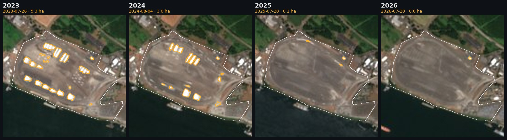
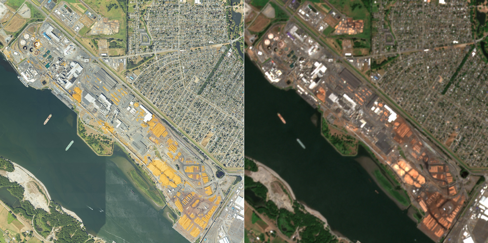

# Sentinel Stockpile

### The economy you can see from space.

Logs stack up at a Columbia River mill. Wind-turbine blades wait on the docks for their trucks to the Gorge. Containers pile up behind the cranes in Tacoma. All of it is visible from 786 km up, every few days, for free.

Sentinel Stockpile watches four Pacific Northwest yards with the European Space Agency's Sentinel-2 satellites, measures how much of each yard is covered in cargo on every clear day since April 2023, and keeps doing it twice a week on its own.

**→ [Live dashboard](https://brooksgroves.com/sentinel-stockpile/)** · map with every clear scene and its outlined piles, time series, year-over-year chart, the numbers as CSV.



*Terminal 5 at the Port of Vancouver USA, the region's wind-energy laydown yard, on a clear late-July or early-August day in each of the last four summers. Orange outlines are what the classifier calls blades; the white line is the yard.*

---

## What four summers show

Median active stockpile area over June–September, from every clear Sentinel-2 pass:

| Site | Cargo measured | 2023 | 2024 | 2025 | 2026 |
|---|---|---:|---:|---:|---:|
| [Port of Vancouver USA, Terminal 5](docs/charts/vancouver_wind_yoy.png) | wind-turbine blades | 3.6 ha | 1.2 ha | 0.3 ha | 0.1 ha |
| [Port of Longview](docs/charts/longview_port_yoy.png) | wind-turbine blades | 5.9 ha | 4.3 ha | 3.2 ha | 2.7 ha |
| [Weyerhaeuser Longview](docs/charts/weyerhaeuser_longview_yoy.png) | logs, lumber, chips | 33.1 ha | 34.1 ha | 31.7 ha | 25.0 ha |
| [Port of Tacoma, Husky + East Sitcum](docs/charts/tacoma_port_yoy.png) | container stacks | 7.4 ha | 12.8 ha | 11.4 ha | 9.1 ha |

(15–31 clear scenes per summer per site; 2026 runs to the end of September. Tacoma is total stack area: container yards have no always-on ground to subtract. The wind rule measures big, bright, neutral-white cargo, which on the photos is blades and towers.)

- **Terminal 5 has emptied, and Longview has more than halved.** Terminal 5 went from rows of blades across the yard in 2023 to bare pavement in 2025 and 2026. Longview's blade racks have shrunk every summer too, by more than half since 2023. The data shows the decline, not its cause: project pipelines, interest rates, supply chains and federal wind policy all moved over these years.
- **The log yard's summer is smaller this year.** Weyerhaeuser's decks and chip piles fill every summer (and read lower every winter, partly because wet wood is darker); summer 2026 is about a quarter below the three before it.
- **Tacoma's stacks jumped in 2024** and have eased since, while staying above 2023.

These are areas, not volumes or counts, and they are an index of activity. The [dashboard](https://brooksgroves.com/sentinel-stockpile/) lets you click any scene and check the outlines against the picture.

---

## How it works

1. **Find the passes.** For each site, every Sentinel-2 L2A scene since the start date is found on [Microsoft Planetary Computer](https://planetarycomputer.microsoft.com/dataset/sentinel-2-l2a), keeping one per day whose footprint covers the whole yard.
2. **Screen for weather.** Sentinel's own scene classification (SCL) has to show under 10% cloud and shadow in a window of 3 km or more and almost none over the yard. Passes over 80% cloudy are skipped outright; of the rest, 40–58% still fail, at the worst rate in winter. Later, scenes whose yard is much brighter than usual in blue (cloud the mask missed, wildfire smoke) and scenes with a fifth of the yard under snow are set aside too.
3. **Put every scene on one grid.** Six bands (blue, green, red, NIR, SWIR1, SWIR2) are warped onto a fixed 10 m UTM grid per site, with Sentinel-2's +1000 reflectance offset removed. These band stacks are cached on the `stacks` branch, so reclassifying never re-downloads anything.
4. **Classify each pixel by colour,** with one rule per kind of cargo, on true surface reflectance:
   - *Logs, lumber and chips* are warm: red well above blue, (R−B)/(R+B) > 0.25, above a brightness floor that leaves out the dark bark mud between the decks.
   - *Wind-turbine blades* are bright, neutral white: brightness > 0.2 with no warm tint.
   - *Container stacks* are mostly red, orange and brown paint, warmer than the grey pavement around them. Blue and white boxes are missed, so this is an index of fullness, not a count.
   - Water must be both greener than NIR and dark in the NIR (white blades have a slightly positive NDWI). Snow is bright in the visible and dark in SWIR.
   - Ground whose NDVI is high on a good share of dates is never counted: in August, dry grass is the same colour as a log deck, but in spring it turns green.
5. **Clean into piles.** Specks under three pixels (300 m²) are dropped, pinholes filled, and each connected pile becomes a polygon with its outline smoothed.
6. **Measure.** Total area; *active* area, which leaves out pixels that read as cargo on 90% or more of clear scenes (white roofs, slabs); number and size of piles; a 21-day running median; and a norm for each week of the year from earlier years.
7. **Publish.** One commit with the site data, charts and the dashboard's JSON.

The rules live in [`sites/commodities.json`](sites/commodities.json), each with a sentence on why it works. They were set from index values sampled on the 2023 USDA NAIP aerial photo (0.6 m) of each yard and checked by outlining the result on that photo. The checks are in [`docs/validation/`](docs/validation/).



*Left: the NAIP photo of 1 August 2023 with every 10 m pixel the lumber rule picks on 31 July outlined. Right: that Sentinel-2 scene.*

### Running on its own

[`.github/workflows/monitor.yml`](.github/workflows/monitor.yml) runs every Monday and Thursday. Each site gets its own job (fetch new passes, rebuild the series), then a single publish job merges them and commits once. Run it by hand to backfill (`start`), reclassify cached scenes after changing a rule (`rebuild = true`), or run some sites only (`sites`).

[`validate.yml`](.github/workflows/validate.yml) refreshes the NAIP photos, and can scout a new location (a wide NAIP view plus the OpenStreetMap outlines around a point) when you're drawing a new yard.

---

## v3: what changed, and what v1 got wrong

The first version of this project ran from a notebook and a monthly workflow. Rebuilding it turned up three problems that changed its numbers, so they're worth saying plainly:

- **Two sites were in the wrong place.** The "Port of Vancouver" box sat on downtown Vancouver, about 5 km southeast of Terminal 5, and the Weyerhaeuser box sat on downtown Longview. v1's Vancouver wind figures (summer peaks of 53–73 ha) were measuring bright downtown roofs, not blades. Every yard is now an OpenStreetMap outline of the actual terminal.
- **The reflectance offset was never removed.** Since processing baseline 04.00 (January 2022), Sentinel-2 L2A values carry a +1000 offset. v1's thresholds were tuned on the offset values, which made ordinary pavement look like cargo; on the correct outlines its rules called between a quarter of a yard and all of it stockpile (Tacoma: every day, every pixel).
- **The pipeline had been failing since April**: three jobs raced to push their results, and GitHub had switched the schedule off for inactivity.

v3 adds the per-cargo colour rules above, the seasonal-green, snow and haze screens, per-site grids, cached band stacks, one-commit publishing, the validation tools and the dashboard. The Port of Longview, which v1 tracked as lumber, is now measured for blades: inside its outline, the 2023 photo shows blade racks and steel, and the log decks are next door at Weyerhaeuser. (Steel pipe and rail are as dark as the pavement and aren't measured.)

---

## Try it yourself

```bash
git clone https://github.com/bdgroves/sentinel-stockpile && cd sentinel-stockpile
pixi install            # or: pip install -r requirements.txt
pixi run stacks         # fetch the cached band stacks (about 230 MB)
pixi run rebuild --site vancouver_wind
pixi run publish
pixi run serve          # dashboard at http://localhost:8000
```

Tune a rule and see it on the aerial photo before committing it:

```bash
python tools/calibrate.py --site tacoma_port --rules '{"warmth_min": 0.18}'
# prints the yard's index percentiles; writes docs/validation/tacoma_port_check.jpg
python tools/summers.py --site tacoma_port     # one midsummer scene per year
```

### Add a site

Drop a JSON file in [`sites/`](sites/): `id`, `name`, `commodity` (a key in `commodities.json`), `latitude`, `longitude`, `start`, a `description`, and an `aoi` polygon (the scout workflow will show you the OpenStreetMap outlines to copy). Then run the monitor workflow with `start` set, and the new site shows up on the dashboard. A new kind of cargo needs a new entry in `commodities.json`; start from `calibrate.py`.

## Files

```
sites/                 one JSON per yard, plus commodities.json (the rules)
stockpile/             the package: sites, fetch, classify, series, publish, validate
tools/                 calibrate.py (rule checks on NAIP), summers.py (year panels)
docs/                  the dashboard (GitHub Pages), its data, charts, validation images
data/<site>/           scene catalog, time_series.csv, last run log
stacks branch          cached 10 m band stacks, one .npz per clear scene
```

Each site's `docs/data/<site>/series.json` holds every scene's numbers, the rules used, the persistent area and what was set aside; `objects/<date>.geojson` has that day's piles as polygons; `data/<site>/time_series.csv` is the flat version.

## Honest limitations

- **Ten-metre pixels** see piles, not individual logs, boxes or blades. A pile smaller than 300 m² is invisible, and a lone blade often is too.
- **Area is not volume.** A deck twice as high looks the same from above.
- **Colour rules have blind spots:** blue and white containers, dark steel, wet wood. Compare like seasons, which is what the norm and the year-over-year chart are for.
- **Optical satellites can't see through cloud.** Winter has gaps of weeks. Sentinel-1 radar would fill them and is the obvious next step.
- **This is a proxy, not inventory data**, and it doesn't isolate causes.

## Tech

[Sentinel-2 L2A](https://sentinel.esa.int/web/sentinel/missions/sentinel-2) via [Microsoft Planetary Computer](https://planetarycomputer.microsoft.com/) · [USDA NAIP](https://naip-usdaonline.hub.arcgis.com/) for validation · [OpenStreetMap](https://www.openstreetmap.org/) yard outlines · pystac-client, rasterio, numpy, scipy, shapely, matplotlib · Leaflet and d3 for the dashboard · GitHub Actions as the computer · [pixi](https://pixi.sh).

## License

MIT. Contains modified Copernicus Sentinel-2 data (ESA). Yard outlines © OpenStreetMap contributors (ODbL).

*Built by [Brooks Groves](https://brooksgroves.com) in Lakewood, WA.*
